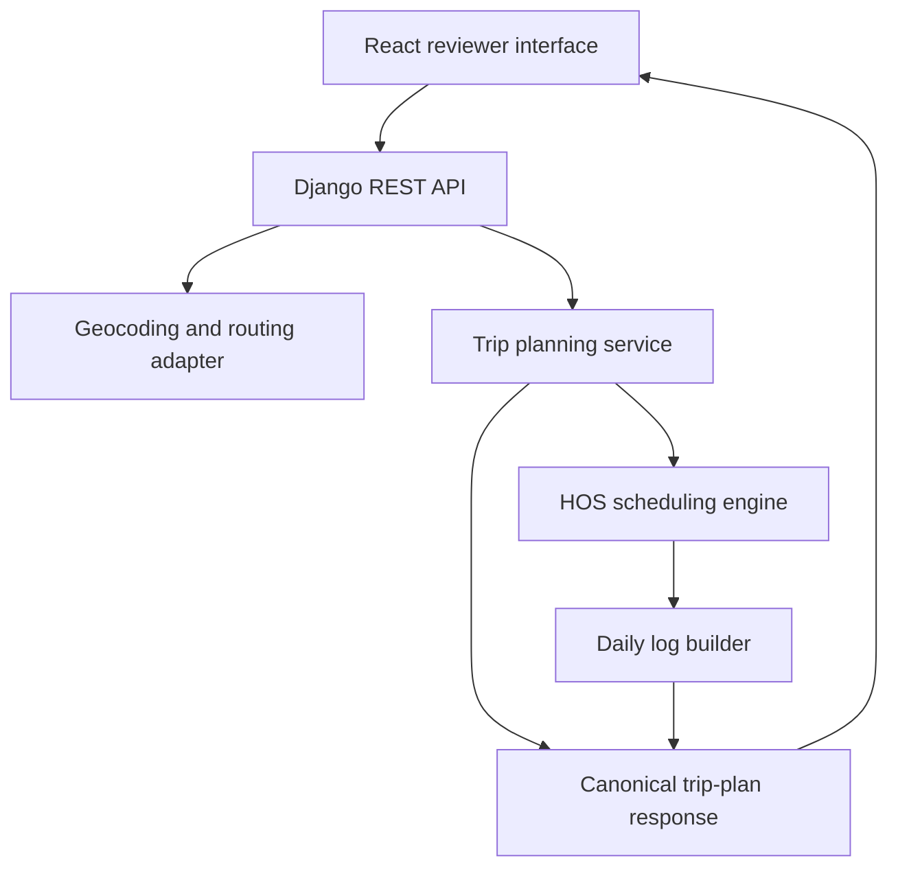

# Spotter ELD Trip Planner End to End Implementation Plan

## 1 Purpose and Target Outcome

Build a polished full-stack assessment application in which a property-carrying truck driver or dispatcher enters:

1. Current location
2. Pickup location
3. Drop-off location
4. Current 70-hour cycle usage

The application must return:

- A road route from the current location to pickup and then drop-off
- Route instructions and estimated trip metrics
- Legally scheduled pickup, drop-off, fuel, 30-minute break, daily-rest, and cycle-restart events
- An interactive map showing the route and every important stop
- A chronological driver plan explaining why each stop was scheduled
- One projected ELD-style daily log sheet for every calendar day touched by the plan
- Printable or downloadable logs
- A deployed reviewer-friendly application, a public source repository, and a 3-5 minute walkthrough

The result is a planning demonstration, not a certified ELD. The application must display that limitation clearly.

## 2 Product Principles for the Implementing Agent

The implementing agent must follow these rules throughout the project:

1. **One source of truth:** The Django backend generates one canonical event timeline. The map, totals, itinerary, stop markers, and log sheets must all be projections of that same timeline.
2. **Correctness before decoration:** Finish and test the Hours of Service engine before building advanced visual polish.
3. **Transparent assumptions:** Never silently invent regulatory or trip information. Return assumptions in the API response and show them in the UI.
4. **No fabricated routing:** If the routing provider fails, show an actionable error or offer an explicitly labelled demo fixture. Never present a straight line as a real truck route.
5. **Secrets stay server-side:** Routing and geocoding API keys must never be bundled into the React application or returned by the API.
6. **Deterministic domain logic:** The scheduler and daily-log builder must be pure functions wherever possible. They must not depend directly on HTTP, the database, wall-clock time, or external APIs.
7. **Accessible, responsive UI:** Every feature must work with keyboard navigation and at mobile, tablet, and desktop widths.
8. **No scope drift:** Do not add authentication, payments, dispatch management, or fleet administration unless every required feature is already complete and verified.
9. **Assessment-safe claims:** Use phrases such as “projected HOS-compliant plan” and “ELD-style log.” Do not call the application a certified ELD or promise legal compliance.
10. **Stage gates:** Do not begin a dependent stage until the preceding stage's acceptance gate passes.

## 3 Recommended Technology Choices

| Area | Recommended choice | Reason |
| --- | --- | --- |
| Repository | Monorepo | One reviewable source tree and coordinated contracts |
| Backend | Python, Django, Django REST Framework | Required stack and clear API structure |
| Frontend | React, TypeScript, Vite | Fast, typed, and easy to deploy |
| UI library | Material UI | Matches the role description and speeds accessible UI work |
| Forms | React Hook Form plus Zod | Good validation and type-safe form state |
| Server state | TanStack Query | Caching, retry control, and clean loading/error states |
| Map | React Leaflet with OpenStreetMap-compatible tiles | Lightweight and assessment-friendly |
| Routing/geocoding | OpenRouteService through a backend adapter | Directions, geometry, instructions, and heavy-vehicle profile support |
| Log drawing | Responsive SVG | Sharp print output and straightforward coordinate testing |
| Backend tests | pytest and pytest-django | Fast domain and API testing |
| Frontend tests | Vitest and React Testing Library | Component and integration coverage |
| End-to-end tests | Playwright | Verifies the deployed reviewer flow |
| Frontend deployment | Vercel | Strong React/Vite workflow |
| Backend deployment | Railway or Render | Straightforward Django service deployment |
| CI | GitHub Actions | Repeatable lint, test, and build gates |

Use supported stable versions and pin dependencies. Do not select experimental packages simply to appear modern.

## 4 Scope and Explicit Assumptions

### 4.1 Required regulatory behavior

Implement the following property-carrying-driver rules:

- Maximum 11 hours of driving after 10 consecutive hours off duty
- Driving permitted only within a 14-consecutive-hour window that begins at the first on-duty or driving event after a qualifying daily rest
- A consecutive 30-minute non-driving interruption after 8 cumulative driving hours without such an interruption
- Maximum 70 on-duty hours in the current 8-day cycle before further driving is prohibited
- Optional 34-consecutive-hour restart when the 70-hour cycle is exhausted
- No adverse-driving-condition extension
- One hour of on-duty-not-driving time at pickup
- One hour of on-duty-not-driving time at drop-off
- At least one fuel stop within every 1,000 route miles

Driving, pickup, drop-off, and fueling add to cycle on-duty time. Off-duty and sleeper-berth time do not.

### 4.2 Necessary assessment assumptions

The supplied input is insufficient for a complete rolling 8-day reconstruction. Therefore implement and display these assumptions:

- `current_cycle_used_hours` is treated as an aggregate balance from the previous eight days.
- The driver starts the planned trip after a qualifying 10-hour rest, so the 11-hour driving and 14-hour window clocks are initially fresh.
- Initial available cycle time is `70 - current_cycle_used_hours`.
- Because prior daily totals are unavailable, hours do not roll off individually during the trip. If further driving is required after the available balance is consumed, schedule a 34-hour restart.
- Use the configured home-terminal timezone for every daily log, even when the physical route crosses time zones.
- Use route-provider travel duration as driving time.
- Schedule fuel conservatively at or before 900 route miles since the previous fuel event, ensuring the distance never exceeds 1,000 miles.
- Use a 30-minute on-duty-not-driving fuel duration unless changed through configuration.
- Do not implement split-sleeper optimization in version one.

### 4.3 Optional advanced inputs

The four assessment inputs must remain visually primary. Put the following in a collapsed “Trip and log options” section:

- Trip start date and time, defaulting to a clear application value
- Home-terminal timezone, defaulting to `America/Chicago`
- Driver name
- Carrier name
- Main office address
- Tractor or vehicle number
- Trailer number
- Shipping document number

These fields enrich the daily log but must not obstruct the basic reviewer flow.

## 5 Target Architecture



### 5.1 Backend structure

```text
backend/
  manage.py
  config/
    settings/
      base.py
      local.py
      production.py
    urls.py
    wsgi.py
  planner/
    api/
      serializers.py
      views.py
      urls.py
      exception_handlers.py
    domain/
      enums.py
      models.py
      rules.py
    services/
      trip_planner.py
      hos_scheduler.py
      route_progress.py
      daily_log_builder.py
      compliance_validator.py
    providers/
      base.py
      openrouteservice.py
      demo_fixture.py
    tests/
      unit/
      integration/
      fixtures/
```

### 5.2 Frontend structure

```text
frontend/
  src/
    app/
      App.tsx
      providers.tsx
      theme.ts
      routes.tsx
    api/
      client.ts
      tripPlan.ts
    components/
      layout/
      feedback/
      common/
    features/
      trip-form/
      trip-summary/
      route-map/
      driver-itinerary/
      directions/
      eld-logs/
      assumptions/
    types/
      tripPlan.ts
    test/
```

### 5.3 Canonical event model

Every scheduled period must use one shared model resembling:

```text
ScheduleEvent
  id
  event_type
  duty_status
  start_at
  end_at
  duration_minutes
  route_leg_id
  route_distance_start_miles
  route_distance_end_miles
  coordinate
  display_location
  reason
  remarks
  counts_toward_cycle
```

Use these duty statuses:

- `OFF_DUTY`
- `SLEEPER_BERTH`
- `DRIVING`
- `ON_DUTY_NOT_DRIVING`

Use these principal event types:

- `DRIVE`
- `PICKUP`
- `DROPOFF`
- `FUEL`
- `BREAK_30_MIN`
- `DAILY_REST_10_HOUR`
- `CYCLE_RESTART_34_HOUR`

The agent must never recalculate separate timing values inside the frontend.

## 6 Stage by Stage Implementation Plan

## Stage 0 Project Contract and Decision Log

### Objective

Eliminate ambiguity before code is written and create a stable definition of success.

### Agent instructions

1. Create `docs/PRODUCT_SPEC.md` containing:
   - Required inputs and outputs
   - Regulatory rules being implemented
   - Assessment assumptions
   - Explicit non-goals
   - User-facing disclaimer
2. Create `docs/DECISIONS.md` and record:
   - Why the backend owns scheduling
   - Why the app uses aggregate cycle usage
   - Why split sleeper is excluded
   - Routing/geocoding provider choice
   - Deployment choice
3. Create `docs/ACCEPTANCE_CRITERIA.md` using the final definition of done in this plan.
4. Decide whether fuel stops use 900 miles or a configurable threshold no greater than 1,000 miles. Use one choice consistently.
5. Decide the precise default start time and make it visible to users. Never hide a hard-coded start time.

### Required outputs

- Three short documentation files
- A fixed terminology list for duty statuses and event types
- A written list of assumptions that can later be returned by the API

### Acceptance gate

- Every requirement from the supplied assignment maps to at least one acceptance criterion.
- No unresolved question can change the HOS algorithm materially.
- Non-goals prevent expansion into a full dispatch platform.

## Stage 1 Repository, Tooling, and Quality Gates

### Objective

Create a professional monorepo that can be run, tested, and reviewed immediately.

### Agent instructions

1. Initialize `backend/`, `frontend/`, and `docs/` directories.
2. Configure Django and Django REST Framework.
3. Configure React, TypeScript, Vite, Material UI, React Hook Form, Zod, TanStack Query, and React Leaflet.
4. Add root-level files:
   - `README.md`
   - `.gitignore`
   - `.editorconfig`
   - `.env.example`
5. Add backend formatting and linting with Ruff; add type checking with mypy if it can be kept stable.
6. Add frontend linting and formatting with ESLint and Prettier.
7. Add GitHub Actions that run:
   - Backend lint
   - Backend tests
   - Frontend lint
   - Frontend tests
   - Frontend production build
8. Add health endpoints:
   - `GET /api/health/` for process health
   - `GET /api/ready/` for configuration readiness without exposing secrets
9. Configure environment-specific Django settings and strict production defaults.
10. Add a root command or documented commands to run frontend and backend locally.

### Required outputs

- Both applications start locally
- CI configuration exists
- Example environment variables are documented
- Empty test suites and builds pass

### Acceptance gate

- A new developer can clone the repository and start both services using only the README.
- No secret is committed.
- CI passes on a clean checkout.
- The browser can call the backend health endpoint through the configured local API client.

## Stage 2 API Contract and Domain Types

### Objective

Define the complete interface before implementing routing or scheduling.

### Agent instructions

1. Define `TripPlanRequest` with:
   - Required location strings
   - `current_cycle_used_hours`
   - Optional start datetime
   - Optional log metadata
2. Validate:
   - Locations are non-empty and sensibly bounded in length
   - Cycle usage is between 0 and 70 inclusive
   - Datetime includes an offset or is interpreted under the configured terminal timezone
3. Define response objects for:
   - Normalized locations
   - Route legs
   - Route geometry
   - Turn-by-turn steps
   - Schedule events
   - Stop markers
   - HOS summary
   - Daily logs
   - Assumptions
   - Warnings
4. Create `POST /api/trips/plan/` with a temporary deterministic stub response matching the complete schema.
5. Publish an OpenAPI schema and a Swagger or ReDoc page.
6. Generate or manually mirror TypeScript response types. Avoid loosely typed `any` values.
7. Define a consistent error envelope:

```json
{
  "error": {
    "code": "ROUTE_PROVIDER_UNAVAILABLE",
    "message": "The route could not be calculated right now.",
    "field_errors": {},
    "request_id": "..."
  }
}
```

### Required outputs

- Complete serializers or schemas
- API endpoint with stubbed data
- Shared API documentation
- Matching TypeScript types

### Acceptance gate

- The frontend can render a stub trip without unsafe type casts.
- Invalid cycle hours and missing locations produce field-level errors.
- The API schema describes every response field.

## Stage 3 Geocoding and Routing Integration

### Objective

Convert the three textual locations into a real route with geometry, duration, distance, and directions.

### Agent instructions

1. Define provider interfaces for:
   - Location search/autocomplete
   - Forward geocoding
   - Reverse geocoding
   - Directions
2. Implement OpenRouteService behind the provider interface. Do not call it directly from views or domain services.
3. Route in two explicit legs:
   - Current location to pickup
   - Pickup to drop-off
4. Request and normalize:
   - Coordinates
   - Route geometry
   - Distance in meters and miles
   - Duration in seconds and hours
   - Step instructions
5. Prefer the heavy-goods-vehicle profile when reliable. If a fallback to normal driving is necessary, return a visible warning in the result.
6. Add timeouts, bounded retries for transient failures, and normalized provider errors.
7. Cache autocomplete and route responses using a conservative cache key based on normalized inputs and provider profile.
8. Add a debounced backend autocomplete endpoint. Require at least three entered characters and avoid sending a request for every keystroke.
9. Implement “Use my current location” in the browser and reverse-geocode through the backend after permission is granted.
10. Never log API keys or raw authorization headers.
11. Build a checked-in demo fixture for one representative trip. Activate it only through an explicit demo action or test configuration.

### Required outputs

- Provider abstraction and OpenRouteService adapter
- Two-leg normalized route result
- Autocomplete endpoint
- Demo route fixture
- Provider unit tests using mocked HTTP responses

### Acceptance gate

- A known US route returns non-empty geometry, distance, duration, and directions.
- Pickup appears exactly between the two route legs.
- Provider failures return useful application errors rather than stack traces.
- No provider key appears in frontend assets, responses, or logs.

## Stage 4 Route Progress and Stop Placement

### Objective

Provide reliable conversion between route distance or driving time and an exact map position.

### Agent instructions

1. Build a `RouteProgress` service that traverses the route polyline and stores cumulative distance.
2. Support lookup by:
   - Absolute miles from trip start
   - Miles within a route leg
   - Fraction of a leg's driving duration
3. Interpolate between adjacent geometry points rather than snapping every event to a leg endpoint.
4. Preserve leg identity so a stop before pickup cannot be placed on the pickup-to-drop-off geometry.
5. Reverse-geocode major scheduled stops after scheduling, not during every scheduling loop iteration.
6. Fall back to a human-readable road-distance label when reverse geocoding fails, for example “Approximately 412 mi into leg 2.”
7. Test the start, end, exact vertex, and between-vertex cases.

### Required outputs

- Pure route-progress utility
- Coordinate lookup tests
- Stable stop-location representation

### Acceptance gate

- A stop at 0 miles equals the trip origin.
- A stop at total distance equals the final destination.
- Intermediate stop markers lie on the returned route geometry.
- Leg-boundary calculations preserve the pickup coordinate.

## Stage 5 Hours of Service Scheduling Engine

### Objective

Generate a chronological, deterministic, and testable sequence of duty-status events.

### Agent instructions

1. Implement the scheduler as a pure service accepting:
   - Route legs and moving durations
   - Start datetime
   - Current cycle usage
   - Rule configuration
2. Track these independent counters:
   - Driving since the last qualifying 30-minute interruption
   - Driving since the last 10-hour rest
   - Elapsed time since the current 14-hour window began
   - Total cycle on-duty time
   - Route miles since last fuel
3. Advance the route in chunks. Before each chunk, compute the nearest constraint boundary:
   - End of current route leg
   - Fuel threshold
   - 8-hour break threshold
   - 11-hour driving threshold
   - 14-hour window boundary
   - 70-hour cycle boundary
4. Append one event up to the nearest boundary, update state, then schedule the required non-driving event before continuing.
5. At pickup, append exactly one hour of `ON_DUTY_NOT_DRIVING`.
6. At drop-off, append exactly one hour of `ON_DUTY_NOT_DRIVING`.
7. Schedule fuel as 30 minutes of `ON_DUTY_NOT_DRIVING` at or before the configured mileage threshold.
8. Treat any consecutive non-driving event of at least 30 minutes as satisfying the 30-minute-break requirement.
9. Remember that a short break does not pause the 14-hour window.
10. When either the 11-hour driving clock or 14-hour window prevents more driving, append 10 consecutive hours in `SLEEPER_BERTH`, then reset the daily clocks.
11. When cycle time prevents further driving and the trip is unfinished, append a 34-hour `OFF_DUTY` restart and reset cycle usage to zero.
12. Allow non-driving work to bring cycle on-duty time to or above 70, but prohibit subsequent driving until a valid restart.
13. Generate precise human-readable reasons, such as:
   - “Required after 8 cumulative driving hours”
   - “10-hour rest resets the 11-hour driving and 14-hour window clocks”
   - “34-hour restart required before additional driving under the aggregate-cycle assumption”
14. Use integer minutes or seconds internally. Do not repeatedly add binary floating-point hours.
15. Add an invariant validator that runs after scheduling.

### Scheduler invariants

- Events are sorted and non-overlapping.
- No event has a negative or zero duration unless it is an explicitly permitted marker.
- Total driving duration equals the provider's moving duration within a defined rounding tolerance.
- Total driving distance equals route distance within a defined rounding tolerance.
- No continuous driving period exceeds eight hours without a 30-minute interruption before further driving.
- No daily driving clock exceeds 11 hours.
- No driving occurs after the 14-hour window expires.
- No driving occurs when cycle on-duty hours have reached 70.
- Pickup occurs once before drop-off.
- Pickup and drop-off each last exactly one hour.
- The route is completed exactly once.

### Mandatory unit-test scenarios

1. A short same-day trip requiring no special stop
2. Exactly eight hours of driving followed by more driving
3. A 7.5-hour drive followed by a one-hour pickup that satisfies the break requirement
4. Exactly 11 hours of driving followed by an unfinished route
5. A 14-hour window expiring before the 11-hour driving limit because of on-duty events
6. Fuel placement on a route longer than 1,000 miles
7. Multiple fuel stops on a route longer than 2,000 miles
8. Cycle starting at 69.5 hours and requiring more than 30 minutes of driving
9. Pickup work consuming the last available cycle time
10. A long trip requiring both daily rest and a cycle restart
11. An event ending exactly at a regulatory boundary
12. Rounding behavior around one-minute boundaries

### Required outputs

- Pure scheduler service
- Rule configuration object
- Invariant validator
- Extensive parameterized unit tests

### Acceptance gate

- Every mandatory test passes.
- Deliberately corrupted schedules are rejected by the invariant validator.
- The scheduler contains no HTTP, view, serializer, or UI dependencies.
- Running the same input twice returns the same event sequence.

## Stage 6 Daily Log Construction

### Objective

Transform the canonical event timeline into complete midnight-to-midnight log data.

### Agent instructions

1. Split all events by calendar-day boundaries in the home-terminal timezone.
2. Clip events that cross midnight and carry their continuation into the following day.
3. Fill any unplanned gaps before trip start and after trip completion with `OFF_DUTY` so each sheet represents 24 hours.
4. Calculate per-day totals for all four duty statuses using integer minutes.
5. Require each day's total to equal exactly 1,440 minutes.
6. Calculate daily driving mileage by apportioning each driving event's mileage across midnight boundaries when necessary.
7. Generate remarks at every duty-status change with event reason and the best available location.
8. Populate supplied or placeholder metadata:
   - Date
   - Driver
   - Carrier
   - Office address
   - Vehicle and trailer numbers
   - Shipping document
   - Total miles
9. Return drawing-ready segments with start and end minute offsets from local midnight.
10. Keep log generation independent of SVG coordinates. The backend returns semantic log data; the frontend owns rendering.
11. Add log validators:
   - No gaps
   - No overlaps
   - Full 24-hour coverage
   - Status totals equal 24 hours
   - Driving mileage is non-negative
   - Remarks correspond to transitions

### Required outputs

- Daily-log builder
- Daily-log validator
- Tests for midnight splits, multi-day events, timezone handling, and 24-hour totals

### Acceptance gate

- Every generated day covers minute 0 through minute 1,440 exactly once.
- Status totals always equal 24 hours.
- A 10-hour sleeper event crossing midnight appears correctly on both sheets.
- The sum of all daily driving miles matches trip driving miles within rounding tolerance.

## Stage 7 Trip Planning Orchestration and Production API

### Objective

Join routing, scheduling, stop placement, reverse geocoding, and log generation into one request flow.

### Agent instructions

1. Implement `TripPlanningService` with this order:
   - Validate and normalize request
   - Geocode three locations
   - Fetch two route legs
   - Build route-progress index
   - Generate HOS schedule
   - Attach coordinates to scheduled route events
   - Reverse-geocode important stops in a bounded batch
   - Build daily logs
   - Run compliance validators
   - Produce summary, assumptions, warnings, and final response
2. Keep Django views thin. Views should handle HTTP concerns and delegate to the service.
3. Add request IDs and structured server logs without sensitive values.
4. Return partial provider diagnostics only when safe and useful.
5. Add an overall request timeout budget and fail gracefully if an upstream provider is too slow.
6. Add idempotent caching for identical trip-plan requests when appropriate.
7. Include API-level integration tests with the provider adapter mocked.

### Required outputs

- Fully functional `POST /api/trips/plan/`
- Complete summary and warning generation
- Integration test fixtures for short and multi-day trips

### Acceptance gate

- One API request returns route, instructions, events, stops, summaries, daily logs, assumptions, and warnings.
- Every downstream section is derived from the same event IDs.
- Upstream failures produce stable error codes.
- Integration tests do not require live network access.

## Stage 8 Frontend Design System and Application Shell

### Objective

Create a visually polished and consistent foundation before feature screens are assembled.

### Agent instructions

1. Create a Material UI theme with:
   - Deep navy or teal as the primary color
   - Coral or amber as a restrained action/alert accent
   - Neutral surfaces with strong text contrast
   - Consistent 8px spacing rhythm
   - 10-14px corner radius range
   - Clear focus rings
2. Use a readable interface font and a tabular-number style for durations and totals.
3. Build a responsive application shell:
   - Compact header with product title and “Planning demo” badge
   - Introductory sentence explaining the workflow
   - Main content constrained to a readable maximum width
   - Footer with data attribution and compliance disclaimer
4. Define reusable components for:
   - Section headings
   - Metric cards
   - Status chips
   - Warning banners
   - Skeleton states
   - Empty states
   - Error panels
5. Define status colors consistently across the map, itinerary, and logs:
   - Off duty
   - Sleeper berth
   - Driving
   - On duty not driving
6. Verify contrast, focus visibility, semantic headings, and reduced-motion behavior.
7. Avoid an overcrowded dashboard. Use progressive disclosure and tabs after the trip is generated.

### Required outputs

- Theme and design tokens
- Responsive shell
- Reusable feedback components
- Basic accessibility test setup

### Acceptance gate

- The shell works at 360px, 768px, 1,024px, and 1,440px widths.
- Keyboard focus is always visible.
- No horizontal page overflow occurs.
- Loading, empty, error, and success visual states exist.

## Stage 9 Trip Input Experience

### Objective

Make the four required inputs fast, understandable, and difficult to misuse.

### Agent instructions

1. Present the required fields in route order with distinct origin, pickup, and drop-off icons.
2. Add debounced address autocomplete with keyboard navigation and accessible listbox semantics.
3. Add “Use my location” beside current location and explain browser permission errors.
4. Use a numeric cycle-hours control with:
   - Range 0-70
   - Decimal support
   - Helper text showing remaining hours
   - A utilization progress bar
5. Put optional metadata and start settings in an expandable advanced section.
6. Add a “Load sample trip” action that fills a meaningful multi-day example.
7. Preserve entered values when planning fails.
8. Disable duplicate submissions while a request is active.
9. Show stage-specific loading text, such as “Calculating route” and “Building daily logs,” without pretending to know exact provider progress.
10. Scroll or focus the first invalid field after validation.

### Required outputs

- Validated trip form
- Address autocomplete
- Browser geolocation flow
- Sample-trip action
- Responsive loading and error behavior

### Acceptance gate

- The entire form is usable without a mouse.
- A reviewer can generate the sample trip in two interactions.
- Errors are located next to the affected field and summarized when necessary.
- Form values survive API errors and edits.

## Stage 10 Results Overview and HOS Explanation

### Objective

Help a reviewer understand the result within seconds before exploring detail.

### Agent instructions

1. Display summary metrics:
   - Total route miles
   - Raw driving duration
   - Planned elapsed duration
   - Estimated arrival
   - Number of fuel stops
   - Number of daily rests
   - Number of log sheets
   - Ending cycle usage or restart status
2. Show a compact compliance summary for the 11-hour, 14-hour, 30-minute, and 70-hour constraints.
3. Include an assumptions and limitations drawer.
4. Surface warnings prominently but avoid alarm styling for normal assumptions.
5. Add “Edit trip,” “Print logs,” and “Download plan JSON” actions.
6. Keep exact values consistent with the canonical response. Do not recompute totals in presentation components.

### Required outputs

- Overview tab or section
- Summary metric cards
- Compliance and assumptions panels
- Export actions

### Acceptance gate

- A reviewer can identify distance, duration, arrival, and required rests without scrolling excessively.
- Every displayed metric maps directly to an API response field.
- Assumptions are discoverable in one interaction.

## Stage 11 Interactive Route Map

### Objective

Visualize the route and connect map stops to the schedule.

### Agent instructions

1. Draw both route legs with visually related but distinguishable styling.
2. Add markers for:
   - Current location
   - Pickup
   - Drop-off
   - Fuel
   - 30-minute break
   - 10-hour rest
   - 34-hour restart
3. Fit bounds to all route geometry after a plan loads.
4. Provide a legend that uses both icon and text, not color alone.
5. Marker popovers must display:
   - Event name
   - Start and end time
   - Duration
   - Location
   - Regulatory reason
6. Link map markers and itinerary events:
   - Selecting an itinerary item highlights and pans to its marker.
   - Selecting a marker highlights the corresponding itinerary item.
7. Cluster only if marker count makes the route unreadable; retain important pickup/drop-off markers outside clustering.
8. Include required map-data attribution.
9. Provide a non-map textual alternative through the itinerary.

### Required outputs

- Route map
- Typed marker components
- Map/itinerary selection synchronization
- Legend and attribution

### Acceptance gate

- All significant non-driving events appear in the correct route order.
- Markers lie on or very near the route.
- The map remains usable on mobile.
- Map failure does not hide the textual trip plan.

## Stage 12 Driver Itinerary and Directions

### Objective

Explain the plan chronologically and make the HOS decisions auditable.

### Agent instructions

1. Create an itinerary grouped by calendar day.
2. Show each event with:
   - Duty status
   - Start and end time
   - Duration
   - Location
   - Miles driven in that event
   - Reason
3. Visually distinguish regulatory stops from operational stops.
4. Add a compact day summary showing drive, on-duty, sleeper, and off-duty totals.
5. Add a separate directions view with ordered turn instructions, distances, and route-leg labels.
6. For very long instruction lists, render progressively or virtualize only if performance actually requires it.
7. Do not mix provider turn instructions with HOS events in one confusing list. Cross-link them through route position instead.

### Required outputs

- Day-grouped itinerary
- Day totals
- Turn-by-turn directions
- Map interaction hooks

### Acceptance gate

- Timeline order exactly matches backend event order.
- Every fuel, break, rest, pickup, and drop-off event explains why it exists.
- Day totals match the corresponding daily log.

## Stage 13 ELD Style Log Rendering and Export

### Objective

Render accurate, attractive, and printable daily log sheets from semantic log data.

### Agent instructions

1. Build an SVG coordinate system with:
   - A 24-hour horizontal axis
   - Four evenly spaced duty-status rows
   - Quarter-hour tick marks
   - Hour labels
2. Map minute offsets to x-coordinates using one shared function.
3. Draw:
   - Horizontal lines for each status segment
   - Vertical connectors at status changes
   - No diagonal transitions
4. Populate metadata and right-side status totals.
5. Render remarks beneath or alongside the graph in chronological order.
6. Add a day selector or tabs for multi-day trips.
7. Add zoom or full-screen inspection without changing underlying data.
8. Implement print CSS:
   - One daily log per printed page
   - No application navigation in print
   - High-contrast black or dark line work
   - No clipped SVG or remarks
9. Provide “Print or save as PDF” using browser printing. Add programmatic PDF generation only if time remains and output quality is verified.
10. Add SVG rendering tests for:
    - X positions at midnight, noon, and 24:00
    - Row positions for all four statuses
    - Vertical transitions
    - Segment coverage
11. Add a visible label: “Projected log for assessment demonstration; not an electronic record of actual duty activity.”

### Required outputs

- Reusable SVG daily-log component
- Multi-day log browser
- Print stylesheet
- Rendering and data consistency tests

### Acceptance gate

- Every line segment corresponds to a backend log segment.
- Displayed row totals sum to exactly 24 hours.
- Each print-preview page contains exactly one complete log without clipping.
- Logs remain legible at desktop and mobile widths.

## Stage 14 Reliability, Security, Performance, and Accessibility

### Objective

Make the project behave like a small production application rather than a fragile demo.

### Agent instructions

1. Add backend protections:
   - Strict allowed hosts and CORS origins
   - Request-size limits
   - Input normalization
   - Provider timeouts
   - Safe exception handling
   - Basic endpoint throttling if hosting permits
2. Add frontend protections:
   - Request cancellation when a new plan starts
   - No unsafe rendering of provider text
   - Clear offline/provider failure messages
3. Add caching for route and autocomplete requests without caching secrets.
4. Keep response size reasonable; simplify route geometry only if visual accuracy remains acceptable.
5. Run keyboard and screen-reader-oriented checks:
   - Form labels
   - Listbox semantics
   - Tabs
   - Map alternative
   - Focus after errors and successful planning
6. Respect reduced-motion preferences.
7. Add observability sufficient for a demo:
   - Request ID
   - Provider latency
   - Total planning latency
   - Error code
   - Never log exact sensitive addresses at high verbosity in production
8. Add a global error boundary and retry action.

### Required outputs

- Hardened settings
- Error boundary
- Performance measurements
- Accessibility test results

### Acceptance gate

- Common upstream failures are recoverable and explained.
- A full trip plan completes within an acceptable reviewer wait under normal provider response times.
- Automated accessibility checks show no critical violations.
- Production configuration exposes no debug trace or secret.

## Stage 15 Comprehensive Testing and Evaluation Scenarios

### Objective

Prove that the application works at rule boundaries and through the complete user journey.

### Agent instructions

1. Maintain a testing pyramid:
   - Many pure scheduler and log-builder unit tests
   - Focused provider and API integration tests
   - A small number of end-to-end browser tests
2. Create stable fixtures for:
   - Short trip
   - Multi-day trip
   - More than 1,000 miles
   - Nearly exhausted cycle
   - 34-hour restart
   - Midnight crossing
3. Add property-style or parameterized checks that all generated schedules satisfy invariants.
4. Add frontend integration tests for:
   - Form validation
   - Loading state
   - Provider error
   - Successful result tabs
   - Multi-day log switching
5. Add Playwright tests that:
   - Load the sample trip
   - Submit it
   - Verify summary, route container, itinerary, and logs
   - Switch log days
   - Open print view
6. Test at desktop and mobile viewport sizes.
7. Manually compare selected schedules against the supplied FMCSA examples and guide.
8. Create `docs/TEST_MATRIX.md` listing scenario, purpose, expected outcome, and automated coverage.

### Required outputs

- Unit, integration, and end-to-end suites
- Test matrix
- Clean CI run

### Acceptance gate

- All invariant tests pass.
- All required flows pass in CI.
- No screenshot or console error appears in the primary browser flow.
- Boundary tests at 8, 11, 14, and 70 hours behave exactly as documented.

## Stage 16 Deployment and Production Verification

### Objective

Provide a stable public URL that works for an evaluator without local setup.

### Agent instructions

1. Deploy the React frontend to Vercel.
2. Deploy Django to Railway or Render. Prefer a service that will not frustrate reviewers with a long cold start.
3. Configure:
   - Production secret key
   - Routing API key
   - Allowed hosts
   - CORS origins
   - Secure proxy headers
   - Static-file handling
4. Point the frontend production API base URL to the deployed backend.
5. Verify HTTPS and mixed-content behavior.
6. Run database migrations even if the project has no custom persistent models.
7. Run smoke tests against production, not only preview deployments.
8. Verify the production build with at least:
   - One short trip
   - One multi-day trip
   - One nearly exhausted-cycle trip
   - One invalid request
9. Check browser console, server logs, map tiles, autocomplete, route calculations, tabs, and print preview.
10. Add a visible demo-data button so a reviewer is not dependent on inventing a test route.

### Required outputs

- Public frontend URL
- Public API health URL
- Production environment documentation
- Completed smoke-test record

### Acceptance gate

- A new incognito browser can complete the full flow.
- No development-only URL or key appears in the production frontend.
- Production print preview produces complete daily logs.
- The live sample route succeeds twice consecutively.

## Stage 17 Documentation, Repository Polish, and Loom

### Objective

Make the implementation easy to evaluate within five minutes.

### Agent instructions

1. Write a reviewer-first README with this order:
   - Live demo link
   - One-sentence product description
   - Screenshot or short preview
   - Feature list
   - Assumptions and limitations
   - Architecture
   - Local setup
   - Environment variables
   - Testing commands
   - API documentation link
   - Deployment notes
2. Include a small architecture diagram and explain the canonical event timeline.
3. Document all HOS rules implemented and excluded.
4. Add a sample request and abridged response.
5. Ensure the repository contains no generated junk, secrets, local databases, oversized media, or dead code.
6. Create `docs/LOOM_SCRIPT.md` for a 3-5 minute recording:
   - 0:00-0:25: Problem and four inputs
   - 0:25-1:20: Run a representative multi-day trip
   - 1:20-2:05: Map, stops, and event explanations
   - 2:05-2:45: Daily logs and print view
   - 2:45-3:35: Backend architecture and HOS engine
   - 3:35-4:15: Tests, assumptions, and error handling
   - 4:15-4:40: Deployment and closing
7. Rehearse the video once and keep the recording inside five minutes.
8. Never claim production certification or perfect regulatory coverage.

### Required outputs

- Reviewer-ready README
- Architecture and rule documentation
- Loom script
- Final video link

### Acceptance gate

- The README lets a reviewer find the live app, run locally, and understand limitations immediately.
- The video shows the deployed app and actual code.
- No unsupported claim appears in documentation or narration.

## 7 Feature Priority and Time Box

### P0 Must ship

- Four required inputs
- Real geocoding and road routing
- Two route legs through pickup
- HOS scheduler covering 8, 11, 14, and 70-hour constraints
- Pickup and drop-off service time
- Fuel stops within 1,000 miles
- Multi-day canonical timeline
- Interactive route map and stop markers
- Daily log sheets with exact 24-hour totals
- Responsive UI
- Deployment, source repository, tests, and Loom

### P1 Strong differentiators

- Address autocomplete
- Use-my-location
- Sample trip
- Advanced log metadata
- Map-to-itinerary synchronization
- Assumptions drawer
- Print-optimized logs
- Downloadable plan JSON
- OpenAPI documentation
- Rich empty, loading, and error states

### P2 Only after every gate passes

- Dark mode
- Recent trips in local storage
- Programmatic PDF download
- Map marker clustering
- Geometry simplification
- Expanded analytics

Do not start P2 work while a P0 correctness or deployment issue exists.

## 8 Suggested Implementation Order for an Autonomous Coding Agent

Use this exact order when assigning work to an implementation agent:

1. Read the assignment, supplied FMCSA guide, and this plan completely.
2. Write the product contract and assumptions before touching UI code.
3. Scaffold the monorepo and make CI green.
4. Define the API contract and TypeScript types using stub data.
5. Integrate and normalize routing.
6. Build and test route-progress interpolation.
7. Build the HOS scheduler with unit tests and invariants.
8. Build the daily-log data model with 24-hour validation.
9. Join everything through `TripPlanningService`.
10. Build the design system and form.
11. Build overview, map, itinerary, and directions from the same API response.
12. Build SVG logs and print styling.
13. Add reliability, accessibility, and end-to-end coverage.
14. Deploy and test the real hosted flow.
15. Finish README, screenshots, and Loom only after production verification.

After each numbered item, the agent must:

- Run the relevant tests and linters
- Report changed files
- Report commands executed and their results
- State any assumption introduced
- Stop if the stage's acceptance gate fails
- Commit a logically isolated change if the repository workflow permits commits

## 9 Instructions That Can Be Given Directly to the Coding Agent

Use the following as the top-level execution prompt:

> Implement the Spotter ELD Trip Planner by following `spotter_eld_trip_planner_implementation_plan.md` stage by stage. Treat each stage's acceptance gate as mandatory. Build one canonical backend event timeline and derive the map, summaries, itinerary, stops, and daily logs from it. Prioritize regulatory correctness, deterministic tests, responsive UX, and reviewer reliability. Keep all provider keys server-side. Do not add P2 features while a P0 or P1 acceptance criterion is failing. After every stage, run relevant tests and linters, summarize changed files and decisions, and do not proceed past a failed gate. Do not copy an existing candidate repository. Use the supplied FMCSA guide as the domain reference and clearly label the output as a projected planning demonstration rather than a certified ELD.

For each stage, give the agent only that stage plus the global rules. This reduces context drift and makes defects easier to isolate.

## 10 Final Manual Review Checklist

### Functional

- [ ] Current, pickup, and drop-off addresses resolve correctly
- [ ] Route passes through pickup before drop-off
- [ ] Distance, duration, and directions are present
- [ ] Pickup and drop-off are each one hour on duty
- [ ] Fuel is scheduled before exceeding 1,000 miles
- [ ] Break occurs before driving beyond eight cumulative hours
- [ ] Driving never exceeds 11 hours between qualifying rests
- [ ] Driving never occurs outside the 14-hour window
- [ ] Driving never occurs at or beyond the 70-hour cycle limit without restart
- [ ] Multi-day events split correctly at midnight
- [ ] Every daily log totals exactly 24 hours

### Experience

- [ ] Reviewer can load a sample trip quickly
- [ ] Mobile and desktop layouts are polished
- [ ] Loading takes over the relevant region without blanking the entire page
- [ ] Errors preserve the form and suggest a remedy
- [ ] Map markers and itinerary events correspond
- [ ] Assumptions are easy to find
- [ ] Print preview contains one clean log per page

### Engineering

- [ ] No API key exists in Git history or frontend bundles
- [ ] Unit, integration, and end-to-end tests pass
- [ ] CI is green
- [ ] Production debug mode is disabled
- [ ] Error responses do not expose stack traces
- [ ] API documentation matches the deployed response
- [ ] README setup works from a clean clone

### Submission

- [ ] Live URL works in an incognito browser
- [ ] GitHub repository is public and readable
- [ ] README leads with live demo and core features
- [ ] Loom is between three and five minutes
- [ ] Loom demonstrates the hosted version and code
- [ ] Disclaimer and known limitations are visible

## 11 Definition of Done

The project is complete only when a reviewer can open the live URL, load a sample multi-day trip, see a real road route with legally explained stops, inspect an internally consistent itinerary, switch through complete daily log sheets whose totals each equal 24 hours, and print those logs without clipping. The public repository must pass its documented test and build commands from a clean checkout, contain no secrets, explain its assumptions honestly, and include a concise walkthrough of the deployed product and core scheduling architecture.
